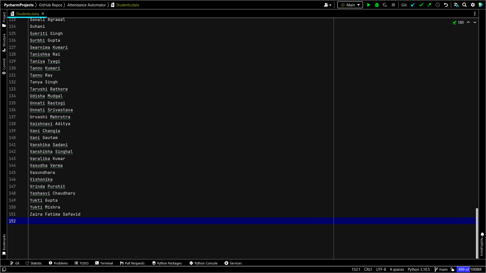
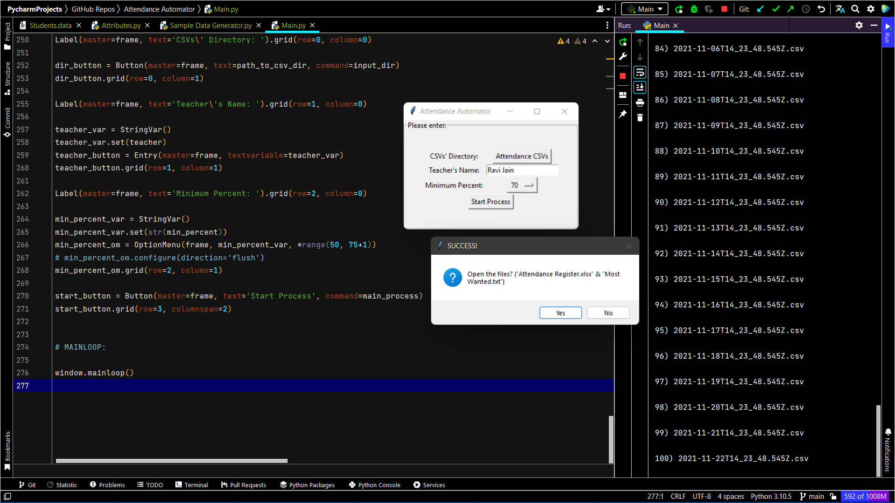

# Online Class Attendance Automator (For Google Meet)

 

## Highlight

✅ Developed a software during COVID-19 to automate daily online class attendance into a single Excel sheet for my father, a teacher, saving 5 to 10 minutes per 60-minute class previously spent on manual attendance — that’s 3 to 6 hours/week.

✅ Implemented actionable attendance analytics, configurable attendance rules, and bulk test data generation.


## 🔧 What the Project Does

This software automatically consolidates Google Meet attendance into a centralized **Attendance Register**—a structured Microsoft Excel worksheet—eliminating the need for manual data entry. It not only records daily attendance in real-time but also provides features like:

* Configurable attendance rules (e.g., minimum join duration)
* Auto-generated insights on students with low or perfect attendance
* Bulk test data generation for simulation or testing

All it takes is one click to generate a semester-long attendance record that would otherwise take hours to compile manually.


## 💡 Why the Project is Useful

In online classes (like those on Google Meet), teachers often rely on Chrome extensions that export daily attendance as separate CSV files. Over a semester, this results in **dozens of scattered files**, making it a nightmare to consolidate and analyze attendance—especially for large classes.

For example, with 60 students and 90 classes, a teacher would need to manually process over **5,000 entries** just to build a single, complete attendance sheet.

This tool **solves that problem completely** by:

* Merging all attendance data into a single Excel register
* Applying attendance criteria automatically
* Saving **3–6 hours per week** that were previously wasted on manual tracking

It’s fast, intelligent, and tailor-made for teachers managing virtual classrooms.


## 🛠️ Installing the Dependencies

After downloading the project, navigate to the project directory, open a [command-line interface](https://en.wikipedia.org/wiki/List_of_command-line_interpreters) (e.g., Command Prompt on Windows), and run:

```bash
pip install -r requirements.txt
```


## 🚀 Getting Started

Follow these steps to set up and run the project:

### 1️⃣ Add Student Names

Open [`Students.data`](Students.data) and add the **full names** of all the students of your class.



### 2️⃣ Configure Project Settings

Update the necessary attribute values in [`Attributes.py`](Attributes.py). Make sure to read the inline instructions there carefully before making changes.


### 3️⃣ Add Attendance CSVs

Clear the contents of the [`Attendance CSVs`](Attendance%20CSVs) folder and copy your daily Google Meet attendance CSV files into it.

📌 *No attendance files yet?*
Generate sample data for testing by running [`Sample Data Generator.py`](Sample%20Data%20Generator.py) and entering the number of days you want to simulate.


The generated files will be saved to the same folder, ready to be processed.

### 4️⃣ Run the Main Script

Run [`Main.py`](Main.py) to generate the consolidated attendance register.


Make any required changes in the UI and start the process—wait a second, and BOOM!



✅ Your complete attendance report will be saved as [`Attendance Register.xlsx`](Attendance%20Register.xlsx)


📋 Additionally, the names of students with **low attendance** and **top attendance** will be written to [`Most Wanted.txt`](Most%20Wanted.txt) 😝


## ⚠️ Important Notes

1. **Use Only the Recommended Chrome Extension**
   This project supports the [Google Meet Attendance List](https://chrome.google.com/webstore/detail/google-meet-attendance-li/appcnhiefcidclcdjeahgklghghihfok) extension. Other formats are not supported.

2. **Exact Name Match is Crucial**
   Student names in `Students.data` **must exactly match** the names used in Google Meet. Ask students to use consistent, full names.

3. **No Duplicate Names**
   If two students share the same name, make them distinct (e.g., `Samyak Jain 1`, `Samyak Jain 2`). *And remember point 2.*

4. **Export Attendance Same-Day**
   Always export CSV files **on the same date as the class**, to avoid mismatches.

5. **Backup Everything**
   Always keep a backup of your files before running the main program.


## 🔮 Planned Features

1. **Time-Based Attendance Validation**
   Only consider students who attended at least x% of the class duration.

2. **Automated Parent Reports**
   Automatically email parents of students with low attendance (email list required).

3. **Built-in Chrome Extension**
   Developing a native extension to eliminate third-party dependencies and avoid format breakages.

4. **More Enhancements Coming Soon!** 🚀


##

📩 Feel free to reach out: [samyak65400@gmail.com](mailto:samyak65400@gmail.com)
