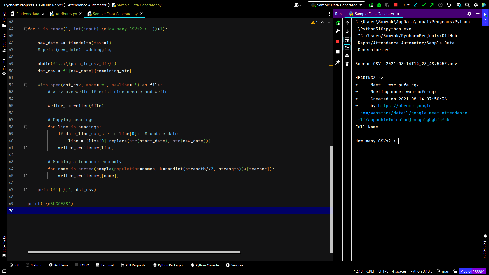

# Online Class Attendance Manager (For Google Meet)


## What the project does

This project can be used to mark the attendance of the students of a class in a proper **Attendance Register** 
(a Microsoft Excel Worksheet) in absolutely no time! This project also have options to analyze the students having low 
attendance (using an Attendance Criteria) and the students with the best attendance.


## Why the project is useful

What happens is, for taking attendance in the online classes like on Google Meet, either the teacher have to take it 
manually every day which waste a lot of time, or the teacher can use some Google Chrome extensions available which 
integrates with Google Meet and can be used to save the attendance after every class (meet), **but**, again a huge 
problem arises here, that the extension just saves the names of the meet attendees like a list in a CSV file every day 
and so if there will be 90 classes in a semester, the teacher will end up having 90 different CSV files 😬, that is 
exactly not what the teachers want, and so if they need all the attendance in a single Attendance Register, they'll 
need to mark 90 x 60 (assuming the class have 60 students) = 5400 entries 🤯, yes, a complete waste of time!!, **SO**, 
you guessed it right, this project will do that work for you in seconds!


## Installing the Dependencies

After downloading this project to your PC, open the project folder, there, open your [command-line interpreter](https://en.wikipedia.org/wiki/List_of_command-line_interpreters#:~:text=In%20computing%2C%20a%20command-line%20interpreter%2C%20or%20command%20language%20interpreter%2C%20is%20a%20blanket%20term%20for%20a%20certain%20class%20of%20programs%20designed%20to%20read%20lines%20of%20text%20entered%20by%20a%20user%2C%20thus%20implementing%20a%20command-line%20interface.) (e.g. Command Prompt for Windows), and run the following:
```
pip install -r requirements.txt
```


## Steps to get started with the project


#### 1) Add the full names of all the students of your class to [Students.data](Students.data).


#### 2) Make the required changes in some attributes' values in [Attributes.py](Attributes.py). (Read the instructions written there carefully.)


#### 3) If you have attendance data (CSV files) ready, first empty the [Attendance CSVs](Attendance%20CSVs) folder and just copy them all to the same and proceed with step 4.

**Else**, we'll be generating sample attendance data! -> 

*This step is only for developers and not teachers, in this step we'll be generating sample attendance data as we don't 
have the real attendance data.*

Run [Sample Data Generator.py](Sample%20Data%20Generator.py) and enter the number of days of attendance you want to 
generate.



It will generate any number of days of attendance in a few seconds and will save them to 
[Attendance CSVs](Attendance%20CSVs) folder ready to be processed by the [main](Main.py) program.


#### 4) Run [Main.py](Main.py), wait for a few seconds, and BOOM! complete [Attendance Register.xlsx](Attendance%20Register.xlsx) will be ready! 
and the names of the students with low attendance and best attendance will be showed on the output window.


### Some important things to take care of

1) Use only [Google Meet Attendance List](https://chrome.google.com/webstore/detail/google-meet-attendance-li/appcnhiefcidclcdjeahgklghghihfok) 
Chrome Extension, because it's format only is being followed in this project, otherwise will not work.

2) Names that you will add in [Students.data](Students.data) **must completely** match with the names of the students 
in the Google Meet class, so ask your students to name themselves correctly in Google Meet otherwise their attendance 
will be skipped.

3) No duplicate names should be there, if your class have students with same full name, don't forget to make them 
distinct (e.g. by adding numbering in the end of the names -> "Samyak Jain 1", "Samyak Jain 2"), also remember point 2.

4) Do export the CSV files on the same date of the class only.

5) Keep backup of all the files before running the project.


## Future Ideas

1) Graphical User Interface (GUI) - for making the process even more easy.

2) Time Restriction - Attendance of the students who were in the class for at least a particular duration of time 
(say 90% of the class duration) will only be considered! 🔥

3) Auto report to Parents - A message (maybe mail) will automatically be sent to the parents of the students with low 
attendance. (Parents data (mail IDs) will be needed.)

4) Independence from Extension - Making an extension itself will end up giving so many advantages 
(e.g. no chance of the program breaking because the Extension changed its format a little)

5) More coming...


#### Written in Python ❤


#### Contact me [@mail](mailto:samyak65400@gmail.com)
